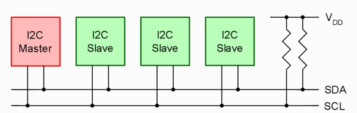

## Fredag - 05/04

[I2C - Linux](https://mars.merhot.dk/w/index.php/I2C_Linux)

I2C - 3 Slaver og en master som kan styre, hvem der skal hvad. 

[I2c - BBB](https://mars.merhot.dk/w/index.php/Beaglebone_black_i2c)

[Grove I2C High Accuracy Temerature Sensor - Seeed](https://mars.merhot.dk/w/index.php/Grove_I2C_High_Accuracy_Temerature_Sensor_-_Seeed)

man I2Cdetect

Læser alle I2C busser 

debian@beaglebone:~$ i2cdetect -r 2

    WARNING! This program can confuse your I2C bus, cause data loss and worse!
    I will probe file /dev/i2c-2 using receive byte commands.
    I will probe address range 0x03-0x77.
    Continue? [Y/n] Y

        0  1  2  3  4  5  6  7  8  9  a  b  c  d  e  f
    00:          -- -- -- -- -- -- -- -- -- -- -- -- -- 
    10: -- -- -- -- -- -- -- -- 18 -- -- -- -- -- -- -- 
    20: -- -- -- -- -- -- -- -- -- -- -- -- -- -- -- -- 
    30: -- -- -- -- -- -- -- -- -- -- -- -- -- -- -- -- 
    40: -- -- -- -- -- -- -- -- -- -- -- -- -- -- -- -- 
    50: -- -- -- -- -- -- -- UU -- -- -- -- -- -- -- -- 
    60: -- -- -- -- -- -- -- -- -- -- -- -- -- -- -- -- 
    70: -- -- -- -- -- -- -- --   

Læser alle I2C med Skærm 

    debian@beaglebone:~$ i2cdetect -r 2
    WARNING! This program can confuse your I2C bus, cause data loss and worse!
    I will probe file /dev/i2c-2 using receive byte commands.
    I will probe address range 0x03-0x77.
    Continue? [Y/n] y
        0  1  2  3  4  5  6  7  8  9  a  b  c  d  e  f
    00:          -- -- -- -- -- -- -- -- -- -- -- -- -- 
    10: -- -- -- -- -- -- -- -- 18 -- -- -- -- -- -- -- 
    20: -- -- -- -- -- -- -- -- -- -- -- -- -- -- -- -- 
    30: -- -- -- -- -- -- -- -- -- -- -- -- -- -- 3e -- 
    40: -- -- -- -- -- -- -- -- -- -- -- -- -- -- -- -- 
    50: -- -- -- -- -- -- -- UU -- -- -- -- -- -- -- -- 
    60: -- -- 62 -- -- -- -- -- -- -- -- -- -- -- -- -- 
    70: 70 -- -- -- -- -- -- -- 

