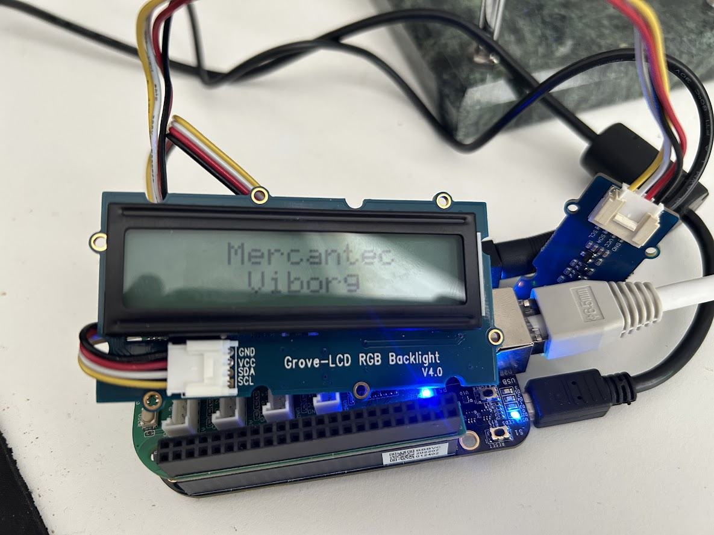

# Display LCD

Download og kør bash-script eksemplet - se linken herunder. Den viser den grundlæggende måde som displayet fungerer på. 
 
De første linjer er initialisering af displayet for for eksempel at forælle LCD-chippen at der er to linjer i det fysiske LCD-display osv.
 
- Lav en C program der har funktioner til fx. at skrive til displayet på en måde der er intuitiv for en applikationsprogrammør.
- Lav en manual der viser applikationsprogrammøren hvorledes displayet anvendes.

Bash Script fra [Mars](https://mars.merhot.dk/w/index.php/Grove_LCD_RGB_Backlight_16x2) - [LCD.bash](LCD.bash)

    debian@beaglebone:~/h5-mags/beagleboard/3.Display-LCD$ chmod +x LCD.bash
    debian@beaglebone:~/h5-mags/beagleboard/3.Display-LCD$ ./LCD.bash

## Manual til Display - LCD

Man kan kalde driveren [./lcdDriverinput1](lcdDriverinput1) direkte

Det tager en enkelt streng som indput og kan vise op til 32 tegn (mellemrum indkluderet). Den kan blandt andet også bruges i jeres programmer, et eksempel på det her [writeToScreen.py](writeToScreen.py)